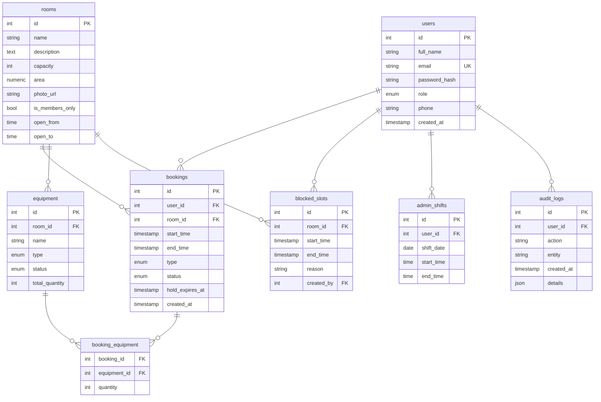

# ER-діаграма — KYT Space

## Зв'язки (дії)
- **users → bookings** — користувач *робить* бронювання (1 : багато)
- **rooms → bookings** — кімната *приймає* бронювання
- **rooms → equipment** — за кімнатою *закріплено* стаціонарне обладнання
- **bookings ↔ equipment** (через `booking_equipment`) — бронювання *містить* переносне обладнання (багато-до-багатьох, з кількістю на слот)
- **rooms → blocked_slots** — кімнату *блокують* (форс-мажор, відключення світла)
- **users → blocked_slots** — менеджер *створює* блокування
- **users → admin_shifts** — адмін/звукар *призначає себе* на зміну
- **users → audit_logs** — користувач *виконує* дію (запис у лог)

## Легенда полів
- `users.role` — `client` | `kutivets` | `admin` | `manager` | `superadmin`
- `rooms.is_members_only` — `true` для Лаунжу та Переговорки (лише кутівцям)
- `equipment.room_id` — nullable; заповнене для стаціонарного, порожнє для переносного
- `equipment.type` — `stationary` | `portable`; `status` — `ok` | `repair` | `written_off`
- `equipment.total_quantity` — ліміт переносного (напр. 3 мікрофони)
- `bookings.type` — `rehearsal` | `podcast` | `event`
- `bookings.status` — `holding` | `pending` | `confirmed` | `cancelled` | `rejected`
- `bookings.hold_expires_at` — час протухання 5-хв lock
- `blocked_slots.room_id` — nullable; порожнє = блокуються всі кімнати
